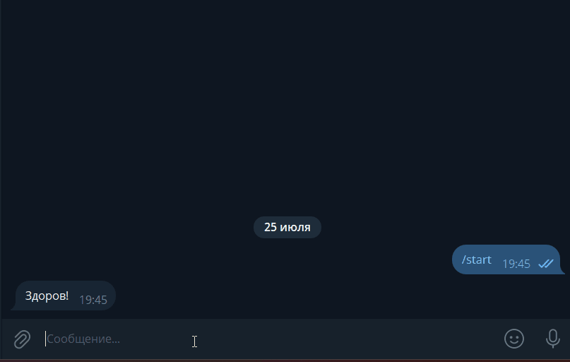

# Умный бот-секретарь (Telegram + ВК + Dialogflow)



Телеграм и ВК боты, которые автоматически отвечают на частые вопросы пользователей с помощью искусственного интеллекта от Google Dialogflow.

## Как это работает

Бот принимает сообщения из Telegram и ВКонтакте. Вместо поиска жестких ключевых слов, текст отправляется в Google Dialogflow, который определяет намерение (Intent) пользователя независимо от того, какими именно словами был задан вопрос. 

- В **Telegram** бот работает асинхронно, отвечая на все сообщения.
- Во **ВКонтакте** бот работает через механизм Bot Long Poll. Если бот не уверен в ответе (срабатывает fallback), он просто молчит, уступая место живым операторам техподдержки, чтобы не спамить в чат лишними фразами.
- База вопросов и ответов загружается в облако автоматически через независимый скрипт обучения.

## Установка

1. Клонировать репозиторий:
```bash
git clone [https://github.com/ваш-username/secretary_bot.git](https://github.com/ваш-username/secretary_bot.git)
cd secretary_bot
```

2. Установить зависимости:
```bash
pip install -r requirements.txt
```

3. Создать файл `.env` в папке проекта:
```bash
TG_BOT_TOKEN=токен_телеграм_бота
DIALOGFLOW_PROJECT_ID=id_проекта_dialogflow
GOOGLE_APPLICATION_CREDENTIALS=credentials.json
VK_BOT_TOKEN=токен_группы_вк
VK_GROUP_ID=id_группы_вк
ADMIN_CHAT_ID=ваш_telegram_chat_id
```

## Как получить токены

**TG_BOT_TOKEN** — токен Телеграм-бота:
- Написать [@BotFather](https://t.me/BotFather) в Telegram
- Отправить `/newbot` и следовать инструкциям
- Скопировать выданный токен

**DIALOGFLOW_PROJECT_ID** - ID вашего проекта в Dialogflow:
- Создать агента на сайте [Dialogflow ES](https://dialogflow.cloud.google.com/)
- Нажать на шестерёнку настроек агента и скопировать `Project ID`

**GOOGLE_APPLICATION_CREDENTIALS** - путь к файлу ключей Google Cloud:
- В консоли Google Cloud создать сервисный аккаунт, выдать ему роль `Dialogflow API Admin`
- Создать и скачать ключ для этого аккаунта в формате JSON
- Положить файл в корень проекта под именем `credentials.json` (это имя должно быть указано в .`env`)

**VK_BOT_TOKEN** - токен вашей группы ВКонтакте:
- Зайти в вашу группу ВК -> Управление -> Дополнительно -> Работа с API
- Нажать «Создать ключ», отметить галочками доступ к сообщениям и управлению сообществом, скопировать токен

**VK_GROUP_ID** - числовой ID вашей группы ВКонтакте:
- Скопировать цифры из адресной строки вашей группы (например, из ссылки `vk.com/club240328938` ID будет `240328938`)

**ADMIN_CHAT_ID** - ваш личный chat_id в Telegram, куда будут приходить уведомления о запуске и падении ботов.

## Запуск

1. Сначала нужно автоматически загрузить базу вопросов из questions.json в Dialogflow и обучить бота:
```bash
python upload_intents.py
```
2. Запуск бота в Telegram:
```bash
python tg_bot.py
```
3. Запуск бота ВКонтакте:

```bash
python vk_bot.py
```

## Пример работы

```
Пользователь: Забыл пароль, не могу войти

Бот: Если вы не можете войти на сайт, воспользуйтесь кнопкой «Забыли пароль?»
под формой входа. Вам на почту прийдёт письмо с дальнейшими инструкциями.
Проверьте папку «Спам», иногда письма попадают в неё.
```

## Зависимости

- `aiogram` — асинхронная библиотека для работы с Telegram Bot API
- `vk-api` — библиотека для работы с API ВКонтакте и Bot Long Poll
- `google-cloud-dialogflow` — официальный SDK от Google для работы с ИИ
- `environs` — чтение переменных из `.env` файла
- `requests` — отправка уведомлений в Telegram при старте и падении бота

## Деплой и мониторинг

Боты развёрнуты на VPS и запущены как systemd-сервисы с автоперезапуском
при падении и автозапуском при перезагрузке сервера.

Если бот упадёт с ошибкой, вы получите сообщение с полным traceback
в Telegram-чат, указанный в `ADMIN_CHAT_ID`.

Рабочие версии ботов:
- [Telegram](https://t.me/secretary_007_bot)
- [ВКонтакте](https://vk.com/club240328937)